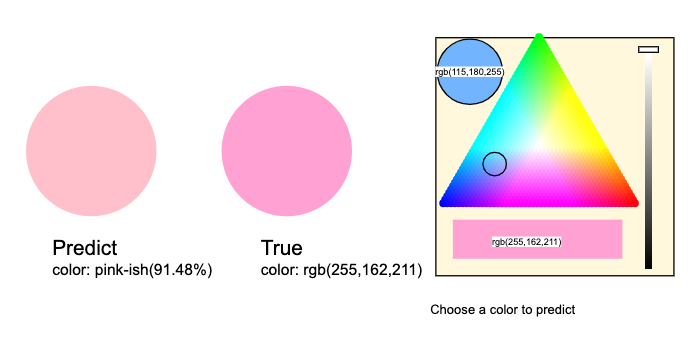

# ml5_ipynb

[](https://mybinder.org/v2/gh/lingruiluo/ml5_ipynb.git/HEAD)

Wraps up ml5.js for Jupyter interface

## Goal

`ml5_ipynb` is designed to allow implementation of the Javascript module [`ml5.js`](https://ml5js.org/) on Jupyter interface for a faster training of simple neural network models and pre-train models with remote GPU.

## Install

### For development
```
pip install -e .
```

### For user
```
pip install git+https://github.com/lingruiluo/ml5_ipynb.git
```

## Introduction

[`ml5.js`](https://ml5js.org/) is a web-based machine learning and deep learning tool that aims to provide access to machine learning and deep learning models. Also, it is a web establishment for presenting machine learning and deep learning training processes and results. It is built on top of tensorflow.js and it can handle GPU-accelerated operations for models.   
The module `ml5_ipynb` is a Jupyter widget version of ml5.js that provides a possibility of implementing machine learning and deep learning models supported by ml5.js on Jupyter interface. The advantage of this module is to allow a bit faster training and predicting of simple models using local machine without GPU/TPU on Jupyter notebook.

### Current support models

Let's briefly introduce the current models provided by ml5_ipynb. More details will be introducted in the [tutorial](https://github.com/lingruiluo/ml5_ipynb/blob/main/ml5_ipynb%20Tutorial.ipynb).

#### Neural network

The neural network class `neuralNetwork` supports three types of deep learning tasks:
  - Regression  
  - Classification   
  - Image Classification (TODO)     
The type of task can be specified in the `options` before initializing the network. A simple way to declare the network is shown as followed.
```python
nn = ml5_ipynb.ml5_nn.neuralNetwork()
```
Examples include [`Simple neural network examples`](https://github.com/lingruiluo/ml5_ipynb/blob/main/examples/Simple%20neural%20network%20examples.ipynb), [`CO2 emission example with multi-layers NN`](https://github.com/lingruiluo/ml5_ipynb/blob/main/examples/CO2%20emission%20example%20with%20multi-layers%20NN.ipynb).

The network can also be collaborated with other Jupyter widgets such as [`jp_doodle`](https://github.com/AaronWatters/jp_doodle). The following example [`Color classification widget`](https://github.com/lingruiluo/ml5_ipynb/blob/main/examples/Color%20classification%20widget.ipynb) is a small color classification tool built by ml5_ipynb and jp_doodle. 
<p align="center">
  
</p>


#### Image Classification

The image classification method is designed to classify an image using pre-trained models including `MobileNet`, `Darknet`, `DoodleNet` and any other saved models. 
  - Use MobileNet model
    ```python
    nn = ml5_ipynb.ml5_image.imageClassifier('MobileNet')
    ```   
  - Use saved model
    ```python
    path = 'user/mymodel.json'
    nn = ml5_ipynb.ml5_image.imageClassifier(path)
    ```
Examples include [`Image classifier on bird examples`](https://github.com/lingruiluo/ml5_ipynb/blob/main/examples/Image%20classifier%20on%20bird%20examples.ipynb).

#### KMeans

ml5_ipynb also has some methods for machine learning models. Currently, we only have kmeans model but will support more later on. Kmeans is a cluster method that can be used for many tasks including image segmentation and object detection. This method is not a best choice for some of tasks such as object detection since it gives different results each time we initialize, however, it can still work.   
In the [example](https://github.com/lingruiluo/ml5_ipynb/blob/main/examples/kmeans%20simple%20example.ipynb) we have here, kmeans uses default number of clusters which is 3 to cluster the image.  
<p align="center">
  
  
</p>

A simple way to create kmean class is 
        ```
        nn = ml5_kmeans.Kmeans()
        ```
There is an example [`kmeans simple example`](https://github.com/lingruiluo/ml5_ipynb/blob/main/examples/kmeans%20simple%20example.ipynb).

#### Object Detection

Object detection method uses YOLO or CocoSsd model. 

```python
# using YOLO
nn = ml5_detector.ObjectDetector('yolo')
```
There is an example [`Object detection using YOLO`](https://github.com/lingruiluo/ml5_ipynb/blob/main/examples/Object%20detection%20using%20YOLO.ipynb) and [`Object detection comparison between yolo and cocossd`](https://github.com/lingruiluo/ml5_ipynb/blob/main/examples/Object%20detection%20comparison%20between%20yolo%20and%20cocossd.ipynb).
